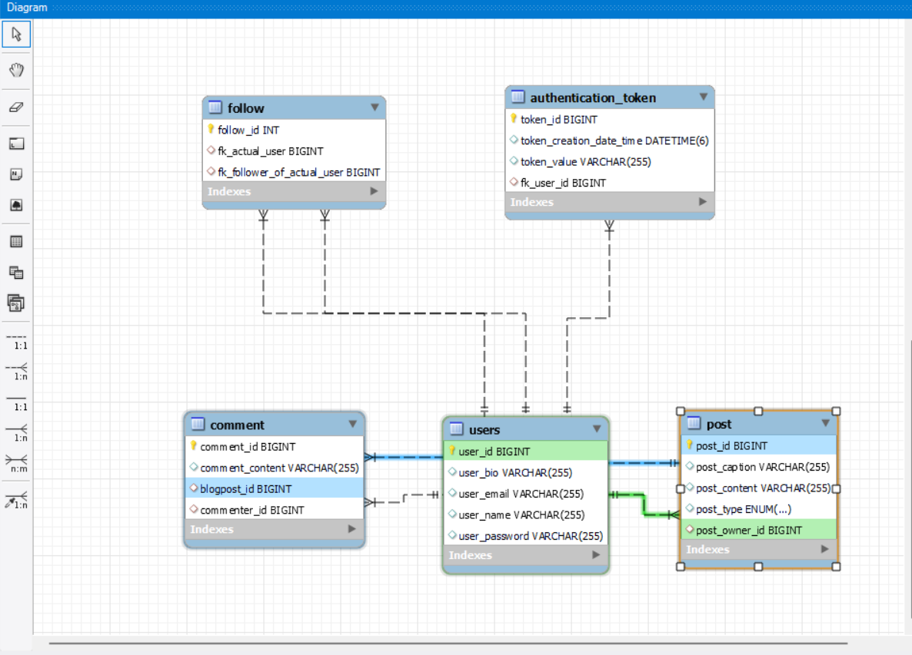
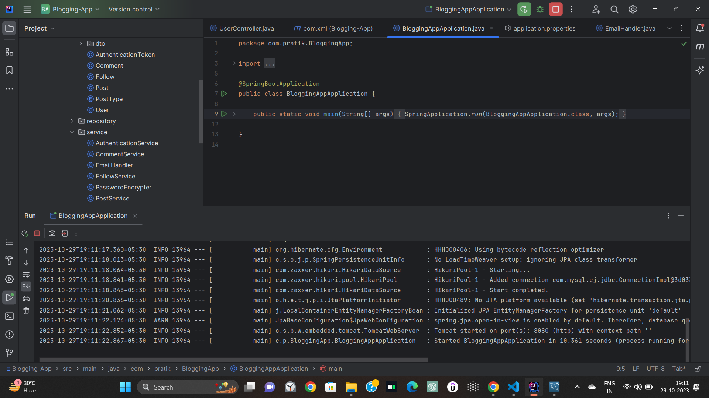

<h1 align="center"> 
🏡Blogging App Project</h1>
This project is aimed at creating Blogging Platform API. This Readme.md file will guide you through the project setup, the models used, and the API endpoints available.

 ### Framework and Language used

- 
- 
- 

 ### Installation

To run this application locally, you will need to have Java and MySQL installed on your machine.

- Clone the repository to your local machine.
- Create a new MySQL database called `blogapp`
- Make sure you have Java JDK above 8 on ur local machine.
- Update the `application.properties` file in the `src/main/resources` directory to include your MySQL username and password
- Run the application using your IDE or by running the command `mvn spring-boot:run` in the project directory
- Access the APIs using any HTTP client such as Postman or Swagger open AI.

### Data flow

> The application is built using the SpringBoot framework and consists of seven layers: DTO, model, controller, service, security, repository and jwt
- **DTO** -The DTO layer consists of classes that are used to transfer data between different layers of the application
- **Controller** - The controller layer handles the HTTP requests, translates the JSON parameter to object, and authenticates the request and transfer it to the business (service) layer.
- **Service** -The business layer handles all the business logic. It consists of service classes and uses services provided by data access layers.
- **Security** -We configure Spring security in this layer by creating security beans such as UserDetailsService,PasswordEncoder,SecurityFilterChain
- **JWT** - In this layer we configure JWT Authentication filter and create Jwt entry point.
- **Repository** - This layer maintains the data by accessing Mysql Database on which CRUD operations are performed.. for that we extend our interface with another interface called JpaRepository.
- **Model** - This layer consists basically the class level things-and this classes are stored in form of tables in given Mysql database as we annotate this class by @Entity.

## Services

* **UserService**

   1. SignUp Blog User
   2. SignIn Blog User
   3. Create Blog Post
   4. Remove Blog Post
   5. Add Comment
   6. Authorize Comment Remover
   7. Remove Blog Comment
   8. Get All Users
   9. Follow User
   10. Update Blog Post
   11. SignOut Blog User
   12. Unfollow User
   13. Authorize Unfollow

  * **PostService**

   1. Create Blog Post
   2. Remove Blog Post
   3. Validate Post
   4. Get Post By Id
   5. Get All Posts

   * **FollowService**

   1. Start Following
   2. Is Follow Allowed
   3. Find Follow
   4. Unfollow
      

   * **CommentService**

   1. Add Comment
   2. Find Comment
   3. Remove Comment
  

   * **AuthenticationService**

   1. Authenticate
   2. Save AuthToken
   3. remove token

- POST /userfollower/follow :- follow user
- GET /userfollower/followed/{id} :- get all followed user of particular user

  * **Repository**

  JpaRepository

  ## **DataBase Design**

## **Data Structure used in our project**
* Arraylist
* MYSQL Database
## **Project Summary**

* This is "Blogging-Platform-Api" Application which follows MVC-architecture.I have created this project by using spring initilizer by taking 7 dependency i.e., lombok, spring web,Mysql,JPA,Email,swagger,and Validation. In my model package I have User,Authentication,Follow,Post,Comment class which has all its related data.
* A user can SignUp and SignIn on Blogging Platform.
* A User can create a Post on Blogging Platform.
* A User can follow another User on Blogging Platform.
* A user can post a comment on another's post on this Blogging Platform.
* A PostOwner can delete his post and comments.
* Any user can delete his comment.

This is a brief summary of my project where we can perform all these task smoothly and efficiently.

 ### Contibutor

* Pratik Sharma
* Mail to: cse.pratiksharma@gmail.com
  
 

